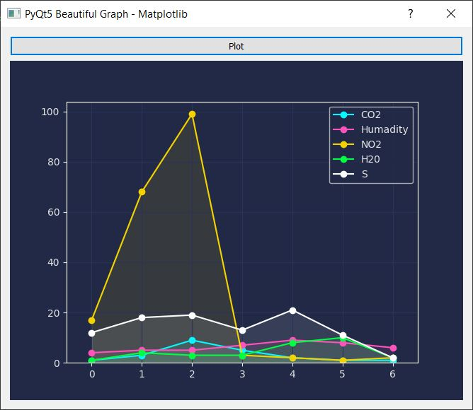

# Integrating-PyQt5-with-Matplotlib-Beautiful-Graph-
A simple GUI to plot a beautiful graph in Matplotlib and integrating it to PyQt5. 

Information:
------------
- Programming Language: Python
- Framework: PyQt5
- Library: PyQt5, Matplotlib, Pandas

Screenshot
---------------

          
